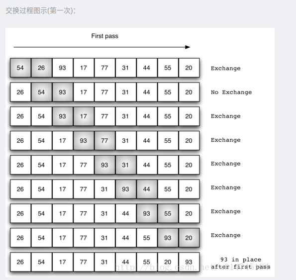

# 冒泡排序

操作步骤：
1. 较相邻的元素。如果第一个比第二个大（升序），就交换他们两个。
2. 对每一对相邻元素作同样的工作，从开始第一对到结尾的最后一对。这步做完后，最后的元素会是最大的数。
3. 针对所有的元素重复以上的步骤，除了最后一个。
4. 持续每次对越来越少的元素重复上面的步骤，直到没有任何一对数字需要比较。

# 选择排序
每次迭代中，选择最小的元素，插入到迭代的起始位置

# 插入排序
打扑克

## 参考：

1. <https://blog.csdn.net/u014745194/article/details/72782962>

